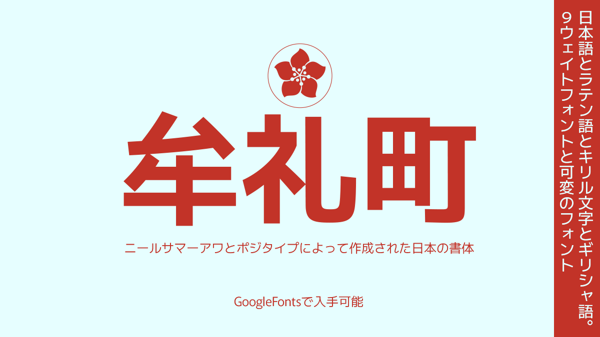
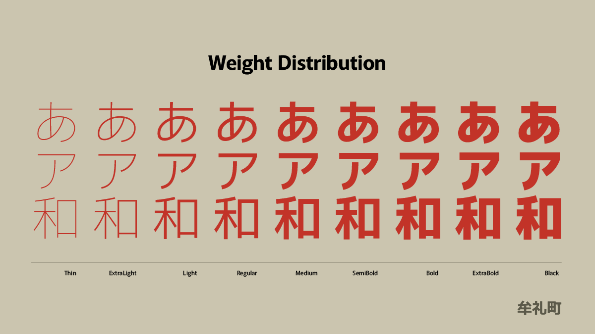

# Murecho
Murecho is a low-stroke contrast, flat terminal Gothic style (“sans serif”) Japanese typeface designed for text settings in Japan. It covers Hiragana, Katakana, and Kanji (JOYO+). It also supports Latin, Cyrillic, and Greek. Murecho is available in 9 practical weights and as a variable font.

# About Murecho, by Positype
For anyone who knows me, knows I have a deeply-rooted connection to Japan. As a teenager, I was an exchange student to Murecho, a beautiful town in Kagawa Prefecture on Shikoku, the smallest of the four main islands in Japan. Traveling to Japan was the first time I had traveled abroad since I left Azores for the US as a young child. It wasn’t until I stepped foot in Japan, and in Mure, that I felt like I had a hometown. Nothing felt ‘right’ or intentional until then. Now, I have life-long friends and an extended family with a connection to those people, that town, and country. In 2006, I learned that Murecho would be merged into the expanded city of Takamatsu. I understood the reasoning and the pragmatism behind better supporting the municipality, but it was still difficult to accept as that name meant something to me. So, it was a very easy decision when tasked to name this new typeface… Murecho would live on in a new environment and shared with everyone.

## Building

Fonts are built automatically by GitHub Actions - take a look in the "Actions" tab for the latest build.

If you particularly want to build fonts manually on your own computer, you will need to install the [`yq` utility](https://github.com/mikefarah/yq). On OS X with Homebrew, type `brew install yq`; on Linux, try `snap install yq`; if all else fails, try the instructions on the linked page.

Then:

* `make build` will produce font files.
* `make test` will run [FontBakery](https://github.com/googlefonts/fontbakery)'s quality assurance tests.
* `make proof` will generate HTML proof files.

## License

This Font Software is licensed under the SIL Open Font License, Version 1.1.
This license is copied below, and is also available with a FAQ at
http://scripts.sil.org/OFL

## Repository Layout

This font repository structure is inspired by [Unified Font Repository v0.3](https://github.com/unified-font-repository/Unified-Font-Repository), modified for the Google Fonts workflow.
